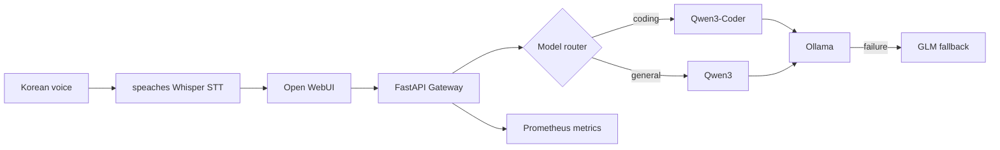

# Local LLMOps Inference Platform

> A production-minded gateway that routes requests across local Ollama models, handles model fallback, and exposes operational metrics.

This project is a portfolio implementation of the practical concerns behind an internal LLM platform: model routing, failure handling, reproducible deployment, and observability. It intentionally uses local models so the complete demo can run on a developer laptop without cloud inference costs.

## What it demonstrates

- **Model routing:** coding prompts route to `qwen3-coder:30b`; general prompts use `qwen3:8b`.
- **Resilience:** unavailable primary models fall back to `glm-4.7-flash:latest`.
- **Operational visibility:** Prometheus request, latency, and fallback metrics; optional MLflow traces with prompt-content collection disabled by default.
- **Reproducibility:** FastAPI, Docker Compose, tests, linting, and GitHub Actions CI.
- **Safe defaults:** no API keys or model weights are committed; model names and endpoints are environment configuration.
- **Deployment mechanics:** a Kubernetes canary rollout exercise (`k8s/`) and a Korean voice-assistant demo (Open WebUI + Whisper) built on the same gateway.

## Architecture



## Quick start

Prerequisites: Python 3.11+, Docker Desktop (optional), and an Ollama server running locally.

```bash
# 1. Start Ollama in a separate terminal if it is not already running.
ollama serve

# 2. Pull the models once.
ollama pull qwen3:8b
ollama pull qwen3-coder:30b
ollama pull glm-4.7-flash

# 3. Configure and run the gateway.
cp .env.example .env
make install
make run
```

Then send a request:

```bash
curl http://localhost:8080/v1/chat/completions \\
  -H 'content-type: application/json' \\
  -d '{"messages":[{"role":"user","content":"Fix this Python function"}]}'
```

Check the running platform:

```bash
curl http://localhost:8080/health
curl http://localhost:8080/metrics
```

### Docker Compose

On macOS, Docker Desktop reaches the host Ollama server through `host.docker.internal`.

```bash
cp .env.example .env
docker compose up --build
```

- Gateway: `http://localhost:8080`
- Prometheus: `http://localhost:9090`
- MLflow: `http://localhost:5000` (on macOS, AirPlay Receiver often holds port 5000 — set `MLFLOW_HOST_PORT=5001` in `.env` if `docker compose up` fails to bind it; the gateway always reaches MLflow over the internal Docker network regardless of this setting)
- Open WebUI: `http://localhost:3001` (Korean voice-assistant demo, see below)
- speaches (whisper STT): `http://localhost:8000`

## API behavior

`POST /v1/chat/completions` follows a compact OpenAI-compatible request shape. An explicit `model` takes priority. Without one, the keyword router sends development questions to the coding model. When the selected model cannot serve the request, the configured fallback model is tried once.

## Validation

```bash
make lint
make test
make eval
```

## Evaluation and load testing

The deterministic routing evaluation set lives in `evaluation/routing_cases.jsonl`. It acts as a small regression gate: a routing-policy change that sends a coding prompt to a general model fails CI.

`load-test/k6-chat.js` provides a repeatable 45-second single-user load test with a 5% error-rate and 20-second p95 latency threshold. Run it after the stack is healthy:

```bash
make load-test
```

**Finding:** a single local Ollama instance serializes inference for one model, so it has no concurrent throughput to test. An earlier version of this test sent 2 req/s and pushed p95 latency past 50s as requests queued up behind each other, even though every request succeeded. The test now models the platform's actual usage pattern -- one active user issuing sequential requests -- against a threshold with headroom over the measured single-request baseline (~15s for `qwen3:8b` on this hardware). Scaling to real concurrent users would require either a hosted multi-replica inference backend or request queuing/backpressure in front of Ollama, which is exactly the kind of constraint the Kubernetes item below is meant to explore.

## Korean voice-assistant demo

`docker compose up` also starts two more services wired to the gateway (not directly to Ollama, so routing/fallback/metrics still apply to every request):

- **speaches** (`ghcr.io/speaches-ai/speaches`) -- a local, OpenAI-API-compatible faster-whisper server for Korean-capable speech-to-text.
- **open-webui** (`ghcr.io/open-webui/open-webui`) -- a chat UI with a mic button, configured with `OPENAI_API_BASE_URLS=http://gateway:8080/v1` as its only model backend, and `AUDIO_STT_*` pointed at speaches. It runs on `localhost:3001` (not 3000) to avoid colliding with an unrelated local Open WebUI instance.

The gateway exposes a minimal `GET /v1/models` so Open WebUI can discover `qwen3:8b` / `qwen3-coder:30b` / `glm-4.7-flash` as its model list.

```bash
./scripts/voice-assistant-demo.sh
```

This synthesizes a Korean test clip (macOS `say`), downloads the whisper model into speaches if needed, creates the first Open WebUI admin account via its API, and drives the full path end to end: audio -> speaches transcription -> gateway `/v1/chat/completions` -> Ollama -> a Korean response. For a live demo, open `http://localhost:3001`, sign in, and use the mic icon directly.

**Finding:** the whisper model choice is a real memory trade-off, not just an accuracy knob. `Systran/faster-whisper-medium` in float32 (this CPU image has no fp16 support) got OOM-killed (exit 137) sharing Docker Desktop's ~8GB VM budget with the rest of the stack; `Systran/faster-whisper-small` fits and transcribes a short Korean utterance in ~5s, at a noticeably higher word-error rate.

## Kubernetes canary deployment exercise

`k8s/` holds manifests for a local canary rollout, run against a [kind](https://kind.sigs.k8s.io/) cluster:

- `deployment-stable.yaml` / `deployment-canary.yaml` -- the same gateway image, differing only by a `GATEWAY_TRACK` env var and replica count (9 stable, 1 canary).
- `service.yaml` -- a single Service selecting the shared `app: gateway` label across both Deployments (not `track`), so kube-proxy load-balances across every pod. No service mesh is involved: the stable/canary replica ratio *is* the traffic split.
- The gateway surfaces its track on `GET /health` and the `X-Gateway-Track` response header, so the split is directly observable.

Run it end to end:

```bash
./scripts/k8s-canary-demo.sh
```

This builds the image, creates the kind cluster if it doesn't exist, applies the manifests, and samples 50 requests through the Service to print the observed stable/canary distribution (consistently ~90/10, matching the replica ratio). Promote or roll back by rescaling:

```bash
kubectl -n llmops scale deploy/gateway-canary --replicas=9 && kubectl -n llmops scale deploy/gateway-stable --replicas=1  # promote
kubectl -n llmops scale deploy/gateway-canary --replicas=0                                                              # roll back
```

Tear down with `kind delete cluster --name llmops-demo`.

**Note:** the kind cluster's node and the docker-compose stack share the same Docker Desktop VM memory budget (~8GB by default). Running both this demo (10 gateway pods) and the full voice-assistant stack below at the same time can trip that limit -- observed as pods getting `OOMKilled` and Kubernetes transparently restarting them. Run one demo at a time, or raise Docker Desktop's memory limit, if you see restarts.

## Tracing and data handling

Docker Compose starts a local MLflow server and enables gateway tracing. Trace metadata includes selected model, roles, message count, latency, and fallback state. Raw prompts and responses are **not** logged unless `TRACE_CONTENT_ENABLED=true` is explicitly set. This makes the privacy trade-off visible in the implementation rather than leaving it as a README promise.

## Roadmap

- [x] Local multi-model routing and fallback
- [x] Health endpoint, metrics, tests, and CI
- [x] Load test scenario and latency SLO threshold
- [x] MLflow tracing, evaluation dataset, and regression gate
- [x] Kubernetes manifests and canary deployment exercise
- [x] Korean voice-assistant demo using Open WebUI and Whisper

## Portfolio walkthrough

1. Start with a coding request and show that it routes to Qwen3-Coder.
2. Stop or rename the primary model and show automatic fallback in `/metrics`.
3. Show the Docker Compose stack and Prometheus request-latency graph.
4. Run the test suite and show the GitHub Actions check.
5. Run `./scripts/k8s-canary-demo.sh` and show the ~90/10 stable/canary traffic split, then promote or roll back with a single `kubectl scale`.
6. Open `http://localhost:3001`, speak a Korean question into the mic, and show the gateway routing that voice request end to end through Whisper STT, the router, and Ollama.

## License

MIT
