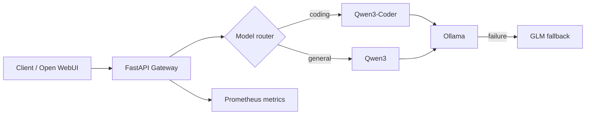

# Local LLMOps Inference Platform

> A production-minded gateway that routes requests across local Ollama models, handles model fallback, and exposes operational metrics.

This project is a portfolio implementation of the practical concerns behind an internal LLM platform: model routing, failure handling, reproducible deployment, and observability. It intentionally uses local models so the complete demo can run on a developer laptop without cloud inference costs.

## What it demonstrates

- **Model routing:** coding prompts route to `qwen3-coder:30b`; general prompts use `qwen3:8b`.
- **Resilience:** unavailable primary models fall back to `glm-4.7-flash:latest`.
- **Operational visibility:** Prometheus request, latency, and fallback metrics; optional MLflow traces with prompt-content collection disabled by default.
- **Reproducibility:** FastAPI, Docker Compose, tests, linting, and GitHub Actions CI.
- **Safe defaults:** no API keys or model weights are committed; model names and endpoints are environment configuration.

## Architecture



## Quick start

Prerequisites: Python 3.11+, Docker Desktop (optional), and an Ollama server running locally.

```bash
# 1. Start Ollama in a separate terminal if it is not already running.
ollama serve

# 2. Pull the models once.
ollama pull qwen3:8b
ollama pull qwen3-coder:30b
ollama pull glm-4.7-flash

# 3. Configure and run the gateway.
cp .env.example .env
make install
make run
```

Then send a request:

```bash
curl http://localhost:8080/v1/chat/completions \\
  -H 'content-type: application/json' \\
  -d '{"messages":[{"role":"user","content":"Fix this Python function"}]}'
```

Check the running platform:

```bash
curl http://localhost:8080/health
curl http://localhost:8080/metrics
```

### Docker Compose

On macOS, Docker Desktop reaches the host Ollama server through `host.docker.internal`.

```bash
cp .env.example .env
docker compose up --build
```

- Gateway: `http://localhost:8080`
- Prometheus: `http://localhost:9090`
- MLflow: `http://localhost:5000` (on macOS, AirPlay Receiver often holds port 5000 — set `MLFLOW_HOST_PORT=5001` in `.env` if `docker compose up` fails to bind it; the gateway always reaches MLflow over the internal Docker network regardless of this setting)

## API behavior

`POST /v1/chat/completions` follows a compact OpenAI-compatible request shape. An explicit `model` takes priority. Without one, the keyword router sends development questions to the coding model. When the selected model cannot serve the request, the configured fallback model is tried once.

## Validation

```bash
make lint
make test
make eval
```

## Evaluation and load testing

The deterministic routing evaluation set lives in `evaluation/routing_cases.jsonl`. It acts as a small regression gate: a routing-policy change that sends a coding prompt to a general model fails CI.

`load-test/k6-chat.js` provides a repeatable 30-second steady-load test with a 5% error-rate and 10-second p95 latency threshold. Run it after the stack is healthy:

```bash
make load-test
```

## Tracing and data handling

Docker Compose starts a local MLflow server and enables gateway tracing. Trace metadata includes selected model, roles, message count, latency, and fallback state. Raw prompts and responses are **not** logged unless `TRACE_CONTENT_ENABLED=true` is explicitly set. This makes the privacy trade-off visible in the implementation rather than leaving it as a README promise.

## Roadmap

- [x] Local multi-model routing and fallback
- [x] Health endpoint, metrics, tests, and CI
- [x] Load test scenario and latency SLO threshold
- [x] MLflow tracing, evaluation dataset, and regression gate
- [ ] Kubernetes manifests and canary deployment exercise
- [ ] Korean document/voice-assistant demo using Open WebUI and Whisper

## Portfolio walkthrough

1. Start with a coding request and show that it routes to Qwen3-Coder.
2. Stop or rename the primary model and show automatic fallback in `/metrics`.
3. Show the Docker Compose stack and Prometheus request-latency graph.
4. Run the test suite and show the GitHub Actions check.
5. Explain the next production increment: tracing/evaluation first, then Kubernetes deployment.

## License

MIT
